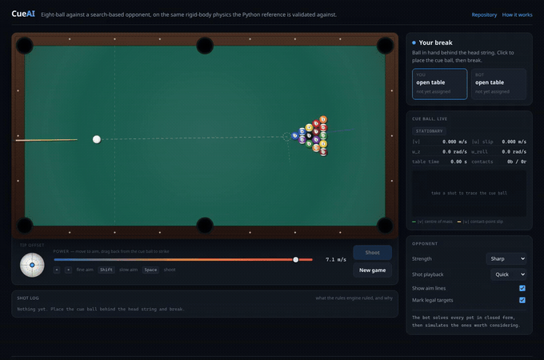
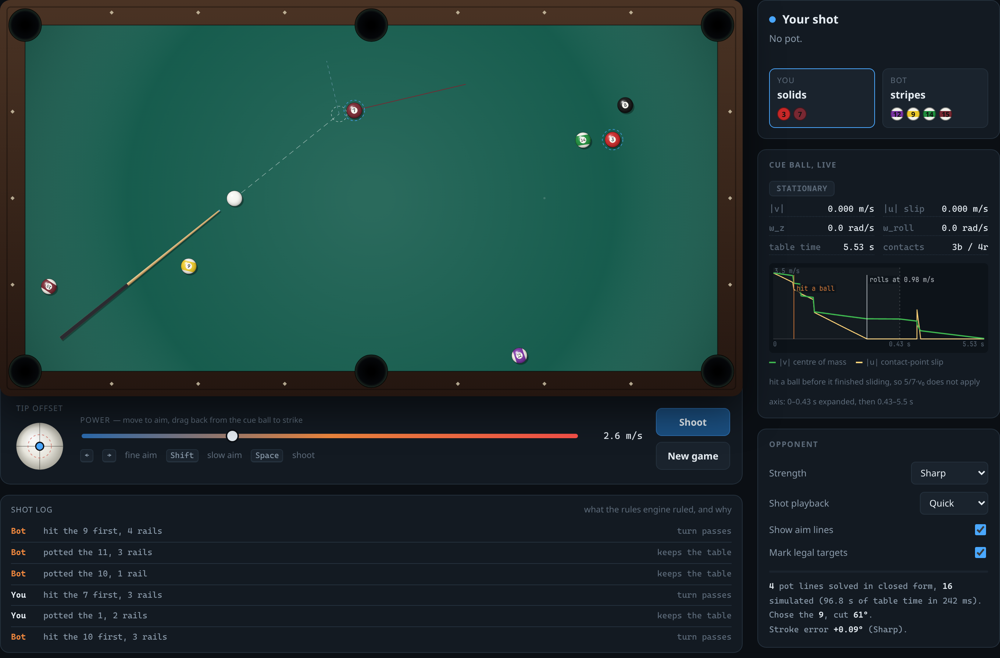
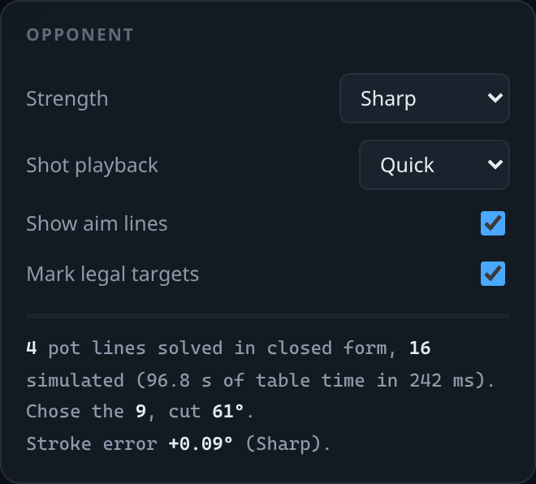
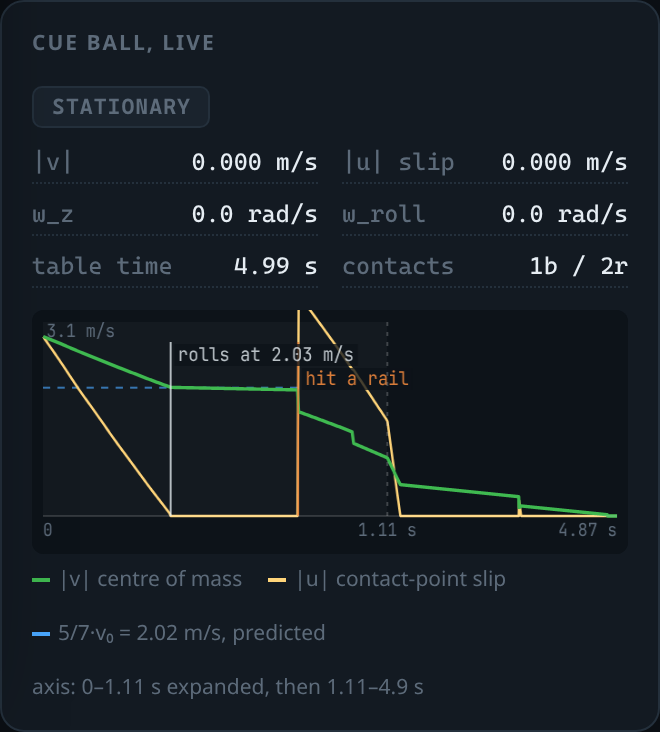
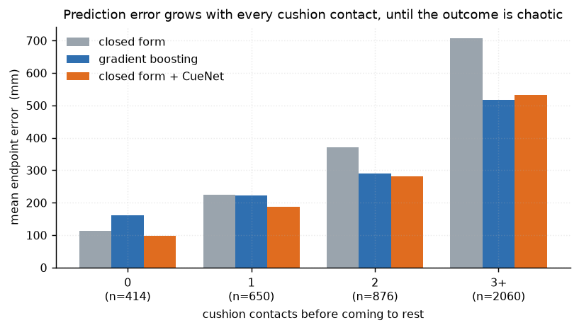
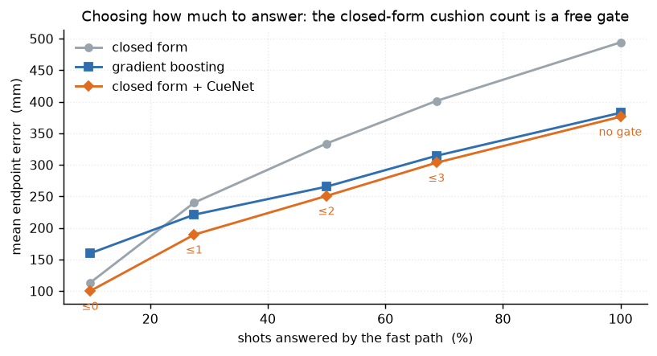
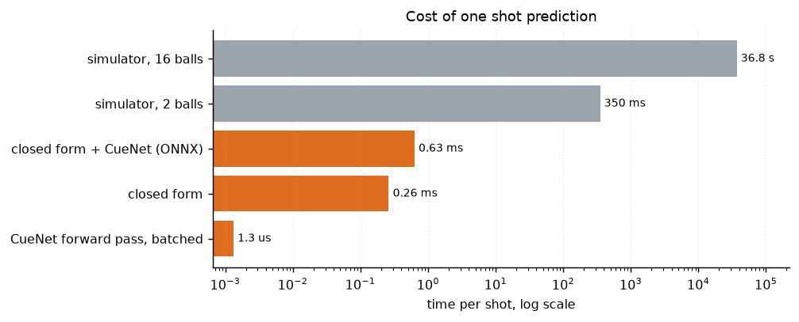
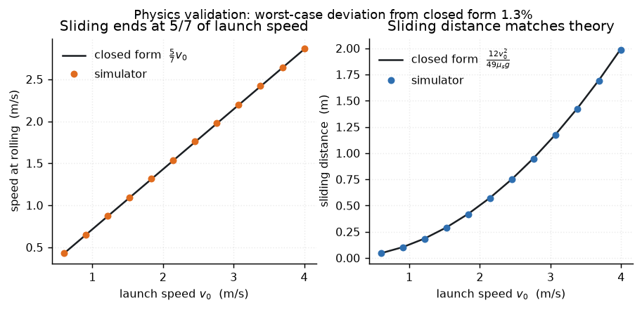
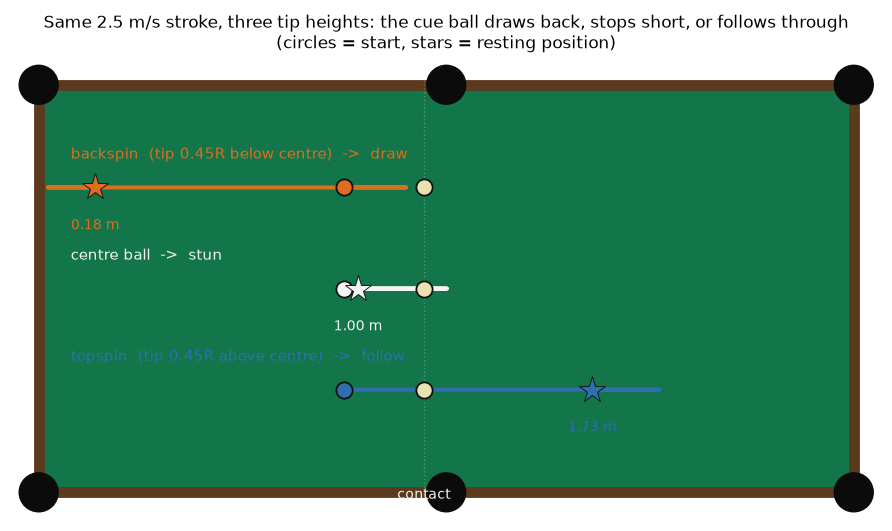
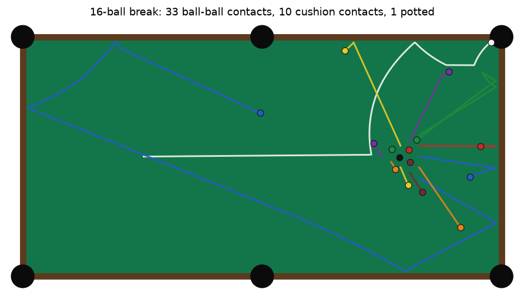

# CueAI

[](https://github.com/BruceMoseti/cueai/actions/workflows/ci.yml)


**A physics simulator for billiards, a closed-form solution that replaces it, and
a learned model that corrects what the closed form misses — roughly 7,600x
faster than integration, with the accuracy measured and the failure mode stated.
Plus a browser game against a search-based bot, running the same physics.**

Predicting where the balls come to rest costs **about 4.6 seconds per rack shot**
by numerical integration. This project reduces that to **0.60 ms** with a mean
error of **98 mm for direct shots** on a 2.54 x 1.27 m table, and — the part that
makes it usable — tells you in advance which of its own predictions to trust.

Every number below comes from this repository: `make all` regenerates the tables
and figures from scratch, and `make test` checks the physics claims against their
closed-form references.

---

## Play it

### **[▶ Play eight-ball against the bot](https://brucemoseti.github.io/cueai/)**



*Recorded by `web/test/capture.mjs` driving the real page in Chrome, at the
"Quick" playback the page offers, with the bot's search pauses capped at
0.8 s. The shots are the game's, not an animation.*

No install, no build step, no framework — `web/` is plain ES modules, and the
whole thing is served as static files. Aim with the mouse, drag back from the
cue ball to strike, click the cue-ball diagram to move the tip off centre. Every
shot is judged by a full eight-ball rules engine, and the log under the table
keeps its reasoning on screen: which ball was struck first, how many rails were
found afterwards, and which of those facts made a shot a foul.



The browser is not running a lookalike physics engine. `web/js/physics.js` is a
hand port of `src/cueai/physics/`, and the port is measured rather than
asserted: `scripts/export_parity_cases.py` runs 35 shots through the Python
simulator — draw, follow, english off two rails, thin cuts, clusters and full
sixteen-ball breaks — and `web/test/parity.mjs` replays every one of them in
Node and compares where each ball stopped.

| | |
|---|---:|
| Reference shots replayed | 35 |
| Worst disagreement, any ball, any shot | **1.2 × 10⁻³ mm** |
| Table time compared | 156 s |
| Browser against the Python reference | **65× faster** |

Continuous integration runs that check on every push and refuses to deploy the
page if the two drift apart.

Twenty headless bot-against-bot games walk every branch of the rules, and check
on each of the roughly eight hundred thousand physics steps they take that no
two balls are ever sharing space and nothing is ever inside a cushion. The worst
overlap seen is 0.5 mm on a 57 mm ball — a fifth of a screen pixel — which is
the difference between "the solver converges" and "it looks like it does".

**The opponent is a search, and that is the argument.**



Aiming needs no learned model: the ghost-ball construction is exact, and a test
asserts that aiming at it pots the ball while half a degree either side misses.
So the bot spends nothing on aiming. It enumerates every ball-and-pocket pair in
closed form, discards what is blocked or cut too thin, and spends its entire
budget *simulating* the survivors to see what each one leaves behind.

It then reports what that cost, every turn, in its own units: four pot lines
solved in closed form, sixteen futures simulated, a minute of table time inside
a third of a second of yours. That is what cheap physics buys, and it is why the
strength setting is a rollout budget rather than an adjective.

<br clear="right" />

**The panels are there to be read.**



A live inspector traces the cue ball's centre-of-mass speed
against its contact-point slip while the shot is in flight, and draws the
predicted `5/7·v₀` rolling speed as a line the measured curve has to land on.
The yellow slip curve collapsing to zero exactly where the green speed curve
flattens onto the blue line is the cloth model's central claim, happening in
front of you, at whatever speed you set the playback to. It is a prediction from
the mechanics, not a fitted parameter.

The prediction is drawn only across the stretch of the shot it is a prediction
about. Hit a rail after the handover, as in the trace above, and the line stops
there, because the speed on the far side of a collision is that collision's
business. Hit something *before* the handover and the panel withdraws the line
entirely and says why, rather than showing the simulation missing a target it
was never aiming at. The time axis expands the first fraction of a second when
the tail is long, because the handover is over in about 150 ms and everything
else is a ball rolling.

<br clear="right" />

**And there is prose under the table.**
[The explainer](https://brucemoseti.github.io/cueai/#how) covers the cloth
model, the parity harness, the bot's search, where the learned surrogate helps
and where it does not, and
[the multi-ball contact bug](#the-bug-the-tests-could-not-see) the single-ball
validation suite could never have caught. Every figure it quotes is written into
it by `scripts/site_facts.py` from the artefacts of an actual run, and CI fails
if the page and the measurements disagree.

```bash
make play      # serve it at http://localhost:8123
make web       # parity against Python, then 20 headless bot-vs-bot games
make browser   # play two games in Chrome, then 15 real-cursor interaction checks
```

That last one is worth a sentence, because it is the layer most browser tests
skip. Calling the page's own functions proves the modules wire together; it says
nothing about pointer capture, the drag threshold that separates lining a shot
up from playing it, or which element owns the spacebar. `web/test/input.mjs`
moves an actual cursor and presses actual keys, and asserts the promises the
interface makes to a player: a quick click does not shoot, drawing the cue back
sets the power without disturbing the aim, shift eases the aim to within a
hundredth of a degree, the spin widget clamps at the miscue limit, and a
dropdown that has focus keeps its own spacebar.

---

## Results

Held-out test set of 4,000 shots from 20,000 simulated shots. Error is the
distance between the predicted and the simulated resting position, averaged over
the cue ball and the object ball. Full tables in
[docs/BENCHMARKS.md](docs/BENCHMARKS.md).

| Method | Cost per shot | Mean error | Direct shots (no cushion) | R² |
|---|---:|---:|---:|---:|
| Numerical simulator, 16 balls | 4.6 s | — (ground truth) | — | — |
| Closed-form solver, no fitting | 0.27 ms | 494 mm | 114 mm | 0.01 |
| Gradient boosting on the same features | 2.6 ms | 382 mm | 162 mm | 0.52 |
| **Closed form + learned residual** | **0.60 ms** | **376 mm** | **98 mm** | 0.43 |

The learned residual has the lowest error of the three, is four times cheaper to
evaluate than the boosted trees, and is the only one that improves on the physics
for the shots where physics is nearly sufficient. Gradient boosting posts the
higher R² by hedging toward the middle of the table on shots nobody can predict,
which flatters the variance-explained metric and costs it 64 mm on the shots that
matter.

### What that average hides

Two thirds of sampled shots never actually reach the object ball. It stays where
it started, which the closed-form baseline predicts *exactly*, so those rows
donate a free zero to half of the error metric. Splitting them out, in mm:

| Ball-ball contact | Share | Closed form cue / object | Boosting cue / object | CueNet cue / object |
|---|---:|---:|---:|---:|
| no | 67.6% | 585 / **0** | 457 / 77 | 411 / 16 |
| yes | 32.4% | 1033 / 798 | **638 / 610** | 736 / 696 |

Two things fall out of this that are worth saying plainly.

The residual formulation earns its keep on the shots where nothing happens: it
adds 16 mm of spurious object-ball motion against gradient boosting's 77 mm,
because "predict zero correction" is its default rather than something it has to
learn.

And it loses on the shots where a collision has to be modelled: 736 mm against
638 mm for the cue ball. That is the cost of anchoring to a baseline with a blind
spot — the closed-form solver has no ball-ball contact model at all, so on a third
of the shot space the residual is asked to undo a metre of error rather than
refine a good guess. Giving the closed form even a crude ghost-ball collision
would be the highest-value next change, and it is a physics change, not an ML one.

### Where it stops working, and why that is the interesting part



A resting position is a smooth function of the shot until the ball starts
ricocheting between cushions. After two or three rail contacts, a millimetre of
cue placement moves the outcome by a table length. The error breakdown above is
published instead of hidden inside a single average, because "this model predicts
direct and one-rail shots to about 10 cm and multi-rail scatter not at all" is a
usable statement, while "376 mm mean error" is not.

### Knowing which predictions to trust, before making them



The breakdown above is sliced by what the simulator *did*, which you only know
after paying the 4.6 seconds. That makes it an autopsy, not a control.

But the closed-form solver reports how many cushions it *expects* on the way to
its answer, and that number is already computed as part of the prediction, so it
is free. It turns out to be a good enough proxy for "is this shot chaotic" to use
as a gate:

| Answer only when the solver expects | Coverage | Mean error |
|---|---:|---:|
| No cushion | 9.8% | **100 mm** |
| At most one cushion | 27.5% | 189 mm |
| At most two cushions | 50.0% | 251 mm |
| Anything (no gate) | 100% | 376 mm |

So the fast path is not a 376 mm model. It is a 100 mm model that knows it should
decline nine shots in ten, or a 251 mm model over half the shot space, and the
shots it declines can be sent to the simulator. A surrogate that reports its own
applicability domain can be deployed; one with a single headline error cannot.
The learned residual is also the most accurate of the three models at every
coverage level, which is a stronger claim than its 1.6% edge on the overall mean.

### Speed



## The physics is verified, not asserted



The simulator is tested against closed-form solutions and conservation laws, not
against its own earlier output. A struck ball must begin rolling at exactly
`5/7` of its launch speed after sliding `12v₀²/(49 μ_s g)`; frictional collisions
must conserve momentum to machine precision; no contact may create energy. See
[docs/VALIDATION.md](docs/VALIDATION.md) for the full table of properties,
tolerances and measured deviations — and for the list of effects deliberately not
modelled, such as cue ball squirt and swerve.

This mattered. The original implementation had the contact-point slip velocity
and the friction torque in opposite handedness, so friction drove a struck ball
*away* from rolling: it slid until it stopped, the rolling speed was `0` instead
of `5/7 v₀`, and stopping distances were four times short. Nothing in the code
looked wrong. A closed-form comparison found it immediately.



*One stroke speed, three cue tip heights. Backspin brings the cue ball back
behind where it started, a centre-ball hit stops it dead at the object ball,
topspin sends it through. All three come out of the cloth model, not from
special-casing.*

### The bug the tests could not see

Closed-form checks exercise one ball at a time, so a defect that only exists
*between* balls survives all of them. This one did.

The collision solver counted two balls as touching when the gap between their
surfaces was under `1e-4 m`, and `rack.py` built the triangle with a `1e-4 m`
clearance. All thirty contacts in the rack therefore sat exactly on the
threshold, and which side each one fell on came down to whether `hypot` rounded
up or down. Sixteen registered. Fourteen did not.

The consequence was a break propagating through a contact graph with holes in
it: balls in the middle of the rack came out of a full-power break having barely
moved, and — the tell — the table opened up *less* the harder it was struck. No
test failed. It was found by measuring break spread against cue speed and
getting the sign wrong.

The fix was to give the tolerance a name (`CONTACT_BAND = 1e-5`), use that one
everywhere the solver asks whether two balls are in contact, and rack the balls
actually touching so nothing sits on the boundary. Three regression tests now
hold it: every contact in a fresh rack is inside the band, the band is orders of
magnitude away from both the floating-point noise below it and the rack spacing
above it, and resolving an untouched rack changes nothing and converges on the
first pass.

The property that caught it is now a fourth test, because it is exactly the kind
nobody writes down: mean distance from the centre of the pack has to rise
strictly from 3 to 6 to 9 m/s. At 8.2 m/s, mean pair separation after a break
went from 0.478 m before the fix to 0.637 m after, and it now increases with
every increase in cue speed instead of falling.

The general point is that a validation suite is only as broad as the situations
it constructs. Ten exact single-ball tests passing is not evidence about sixteen
balls in contact.



## Try it

```bash
git clone https://github.com/BruceMoseti/cueai && cd cueai
python -m venv .venv && source .venv/bin/activate
pip install -e ".[dev]"

make test          # the whole suite, including closed-form validation
make check         # ruff, mypy, tests — what CI runs on the Python side
make play          # serve the playable table at http://localhost:8123
make web           # browser physics against Python, then 20 headless games
make all           # regenerate the dataset, model, benchmarks and figures
```

`make all` takes about 20 minutes end to end on eight cores, of which 15 are
simulating the 20,000 training shots. Generation is seeded per sample, so the
dataset it produces is identical to the one behind the numbers above.

### Serve predictions

```bash
make api           # http://localhost:8000/docs
```

```bash
# Sub-millisecond estimate: closed form plus learned residual
curl -s localhost:8000/predict/fast -H 'content-type: application/json' \
  -d '{"speed": 2.2, "angle_deg": 8, "english_y": -0.3, "cue_x": 0.6, "cue_y": 0.6}'

# Full simulation, with the fast estimate alongside and the gap between them
curl -s localhost:8000/predict -H 'content-type: application/json' \
  -d '{"speed": 2.2, "angle_deg": 8, "full_rack": false, "obj_x": 1.4, "obj_y": 0.7}'
```

### Interactive table

```bash
pip install -e ".[ui]"
make ui
```

Drag balls, aim, shoot. Each rack shot runs the reference simulator, so expect a
few seconds of thinking time — which is the entire motivation for the fast path.

## How it works

Three tiers, each with a different accuracy and cost, described in full in
[docs/DESIGN.md](docs/DESIGN.md).

**1. Numerical simulator.** Four-state cloth dynamics (sliding, rolling,
spinning, stationary) integrated at 1 ms, frictional ball-ball impulses with spin
transfer and throw, cushion rebound with speed-dependent restitution, pocket
capture, and a spatially varying cloth friction field.

**2. Closed-form solver.** No integration. While a ball slides, its slip velocity
decays along a *fixed* direction, so the friction force is constant and the path
is exactly a parabola of known duration. Rolling is a straight line. A shot
becomes a handful of exactly solvable segments joined at cushions, where the
normal velocity is damped while the spin term carries through. That last detail
is what a plain mirror-reflection approximation gets wrong: it disagreed with the
simulator by about a metre, where this solver lands within 114 mm on direct shots
and 225 mm across one rail.

**3. Learned residual.** A small MLP predicts the vector from the closed-form
endpoint to the simulated one. Its output head starts at zero, so training begins
from "trust the physics" and departs only where the data insists. Its inputs
include the closed-form solver's own conclusions — predicted endpoint, expected
cushion count, expected pot, ghost-ball contact geometry. An ablation on the same
architecture, epochs, seed and split puts a number on that: fed raw shot
parameters alone it scores 179 mm on direct shots, worse than the 114 mm of the
physics it was meant to improve; fed the solver's conclusions as well, 98 mm.

## What this demonstrates

Billiards is the domain; the transferable content is below.

**Surrogate modelling of an expensive simulator.** The pattern — establish a
trusted reference, find the closed-form structure inside it, learn only the
residual, and quantify the accuracy you traded for the speed — is the same one
used for pricing engines that are too slow for intraday risk, finite-element
models too slow for design loops, and any Monte Carlo where the inner loop is the
bottleneck. Almost four orders of magnitude here, and they come mostly from the
closed form rather than from the network, which is usually how it goes.

**Validating against theory rather than against yourself.** A snapshot test
would have locked in a sign error that made the central physics wrong. Closed-form
references, conservation laws and analytic decay rates caught it in one run. The
same discipline applies to any numerical pipeline: solve a special case exactly
and check against it.

**Selective prediction with a free confidence signal.** The per-stratum error
breakdown, the prediction-spread ratio and the coverage curve exist so a caller
knows which predictions to trust — and the gating signal falls out of the physics
baseline at no extra cost, rather than requiring a second calibrated model. A
surrogate that is confident everywhere and accurate in half the space is more
dangerous than the slow model it replaced.

**Model selection without leaking the test set.** Epochs are chosen on a
validation split carved from the training data; the test split is scored once,
after training. The GBM comparison uses the identical split.

**Reproducibility as a property of the code.** Dataset generation is parallel and
seeded per sample, so the data is byte-identical on 1 core or 32. Training and
serving construct features through one function, and a test pins the two paths
together, because train/serve skew degrades a model quietly instead of failing
loudly.

**Porting a numerical kernel without letting it drift.** The same physics exists
twice, in Python and in JavaScript, because the browser needed it and the
reference had to stay the reference. A port that nobody measures is a rumour, so
the two are pinned to each other by 35 recorded shots and compared to a
thousandth of a millimetre in CI. The one number that made it worth doing is the
65× speedup, which is what turns "simulate the candidate shots" from a claim
into the thing the bot actually does inside a turn.

**Deployability.** The residual model exports to ONNX and runs through ONNX
Runtime with no PyTorch in the serving path. PyQt and OpenCV are optional extras,
so the package installs headless. CI lints, type-checks and tests on three Python
versions, then runs the whole data to model to benchmark to figures pipeline and
uploads the artefacts. The playable page deploys to GitHub Pages only after the
parity check and a run of headless games have passed.

## Repository map

```
src/cueai/
  physics/
    ball.py         four-state cloth dynamics for one ball
    collisions.py   frictional ball-ball impulses, cushions, pockets
    simulator.py    the 16-ball reference simulator
    analytic.py     the closed-form solver and its derivations
    rack.py         8-ball rack geometry and ball identities
  ml/
    dataset.py      parallel, per-sample-seeded shot generation
    features.py     one feature path for training and serving
    model.py        CueNet, zero-initialised residual head
    train.py        training, baseline comparison, stratified evaluation
    infer.py        predict_fast (0.60 ms) and predict (full simulation)
  api/main.py       FastAPI service
  ui/app.py         PyQt6 interactive table
  vision/overlay.py OpenCV trajectory overlays

web/                 the playable table: dependency-free ES modules
  js/
    physics.js      hand port of src/cueai/physics/, checked against it
    rack.js         the same rack geometry, ported
    game.js         eight-ball rules, fouls, group assignment
    bot.js          closed-form candidate pots, then simulated rollouts
    aim.js          ghost-ball geometry and the first-contact search
    render.js       canvas drawing: table, balls, cue, aim overlay
    inspector.js    the live cue-ball trace against 5/7·v₀
    main.js         input, the fixed-timestep loop, whose turn it is
  test/
    parity.mjs      replays the Python reference shots, compares endpoints
    selfplay.mjs    headless bot-against-bot games, every rule branch
    browser.mjs     drives the real page in Chrome, fails on console errors
    input.mjs       plays with a real cursor and keyboard, not the test seam
    capture.mjs     records the screenshots and the clip in this README

tests/
  test_validation.py  closed-form physics validation
  test_features.py    train/serve feature consistency
  test_physics.py     simulator behaviour
  test_metrics.py     the reported metrics, including the trust gate
  test_api.py         HTTP contract

scripts/
  benchmark.py           writes docs/BENCHMARKS.md
  make_figures.py        writes docs/assets/*.png
  export_parity_cases.py writes the reference shots the browser is held to
  site_facts.py          writes the measured numbers the web page quotes
```

## Limitations

- Not calibrated against a real table. No measurements were taken, so the claim
  is internal consistency with classical mechanics, not fidelity to specific
  equipment. Cloth and cushion coefficients come from the published ranges.
- A break under-spreads, and the size of the gap is measured rather than
  guessed at. A rack is resolved as a chain of pairwise collisions, so
  restitution is applied about fifteen times where the real event dissipates
  once, and only 48% of the kinetic energy survives a 10 m/s break. Balls at the
  back of the rack therefore leave slower than they should. This is the largest
  known departure from reality in the simulator; the arithmetic and the fix it
  would need are in [docs/VALIDATION.md](docs/VALIDATION.md).
- Cue ball squirt and swerve are not modelled, so aiming advice would be
  systematically off for heavy sidespin.
- Multi-rail outcomes are not usefully predictable by any of the three methods
  here, as measured above.
- The fast path predicts *where balls stop*; it is not an aiming aid. On the layout
  in [docs/DESIGN.md](docs/DESIGN.md) the window that pots a ball is a quarter of a
  degree wide — `tests/test_validation.py` asserts that the ghost-ball line pots and
  half a degree off misses — roughly ten times finer than the surrogate resolves.
  Aiming is exact closed-form geometry anyway, and needs no model.
- The reference simulator is straightforward Python. It is a definition of truth,
  not a fast engine; optimisation stopped once the collision loop was no longer
  the obvious bottleneck.

## References

The cloth and collision model follows the standard treatment in Ron Shepard's
*Amateur Physics for the Amateur Pool Player*, Wayland Marlow's *The Physics of
Pocket Billiards*, and David Alciatore's technical proofs; the four-state
formulation matches the approach taken by
[pooltool](https://github.com/ekiefl/pooltool). Coefficients are from the
published ranges in those sources.

## License

MIT — see [LICENSE](LICENSE).
